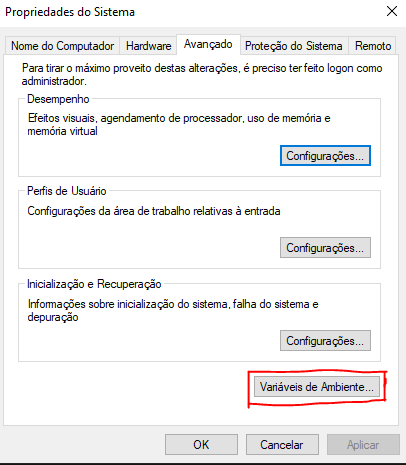
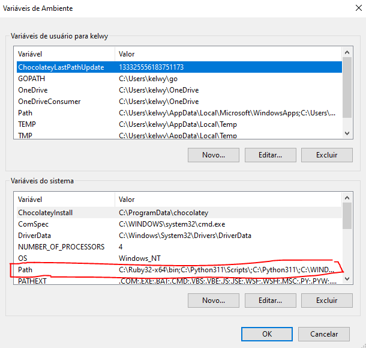
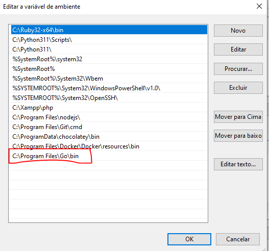

# Go main folders

To see all environment variables Go needs to work do `go env` on you CMD.

- GOPATH: Folder where go will interpret files, or will save the binaries after compilation, or where will download the binaries when using `go get` or `go install`. If it is empty you need to set it on your "path" in "Environment variables".
- GOMODCACHE: GOMOD is a way of dependency management on Go.

Inside the Go path (C:\\Users\\< user_name >\\go ) we can find three files:

1. bin - Where all the binaries we will use will be.
1. pkg - Where go will take the compilations (normally `.a` file types).
1. src - Where we can create our `.go` projects.

## Go mod

On the star, there where not a version control like a node modules, compose for php, or maven for java. All the projects were created inside the src folder.

Now we have a project called go mod which let us program in go in any folder of our computer since you have started a module.

## Testing to Go

Create a file inside the src folder and write:

```go
package main

func main(){
  println("Hello")
}
```

To execute do `go run <file name>.go`

#### Setting the path

On windows search for "Environment variables":

## .

\------------

## .

\------------
.
