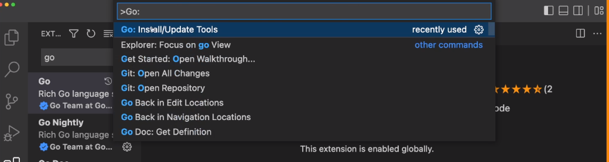
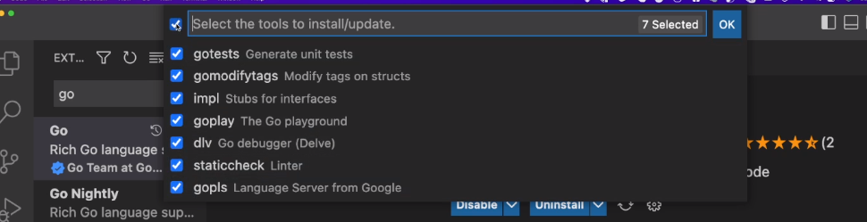

# Go on VScode

IDE for Go: [Jet brains - GoLand](https://www.jetbrains.com/go/)

## On VSCode

Go to extensions and search for the Go extension. It has a badge and says it was created by Google team.

The next step is to press "F1" and write "Go:". Select the "Go: Install/Update Tools" option.

.

Select all the option and click "OK". It will install all the things you will need to work with Go on your VScode.

.

After installation do a little test:

```go
package main

func main(){
  println("Hello")
}
```

To execute do `go run <file name>.go`
